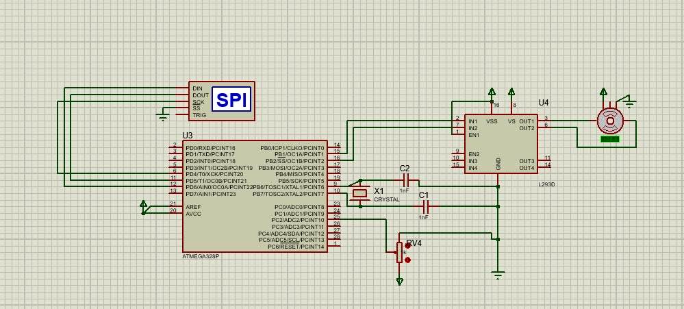

# TurtleBot Robot Task10.2

## Project Overview

This project involves designing and integrating an speed control module for the TurtleBot using an ATmega328P microcontroller. The module aims to enhance the TurtleBot’s movement precision and directions.

### Key Features

- **Motor Speed Control:** Uses PWM to control the motor speed based on analog input from a potentiometer.
- **Directional Control:** Uses 2-bit input to control the direction of the motors.
- **Interrupt functions :** for futur features like sleep to save power when its not used.

## Hardware Setup

### Components

- **ATmega328P Microcontroller**
- **L293D Motor Driver IC**
- **DC Motors**
- **Potentiometer**
- **Encoder**
- **resistors, capacitors**

### Wiring



## Software Setup

### Drivers overview

1. **PWM Configuration :**
    - **discription :** can handle more than mone motor with different timers setup based on three inputs 
        - pulse_width by a 16 bit or 8 bit no for power control
        - timer 8bits or 16 bit
        - pin choise for output


```c
void PWM_Timer(uint16_t pulse_width, uint8_t timer, uint8_t pwm_pin) {

    if (timer == 0) {
        DDRD |= (1 << pwm_pin);

        TCCR0A |= (1 << WGM00) | (1 << WGM01);  // Fast PWM mode
        
        if (pwm_pin == PD6) {
            TCCR0A |= (1 << COM0A1);
        } 
        else if (pwm_pin == PD5) {
            TCCR0A |= (1 << COM0B1);
        }

        TCCR0B |= (1 << CS00);
        TCNT0 = 0;                             //clear register
        
        
        // set the compare match
        if (pwm_pin == PD6) {
            OCR0A = (pulse_width & 0xFF);      //SCALE THE PULSE WIDTH FROM 16 BIT TO 8 BITS
        } else if (pwm_pin == PD5) {
            OCR0B = (pulse_width & 0xFF); 
        }

    } 

    //same for timer1
}
```

2. **ADC (Analog to Digital Converter):**
   - **Function:** Reads analog values from the potentiometer.

3. **Interrupts:**